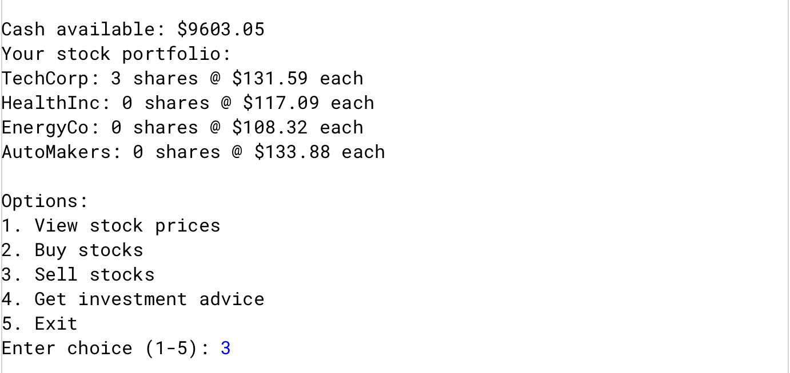
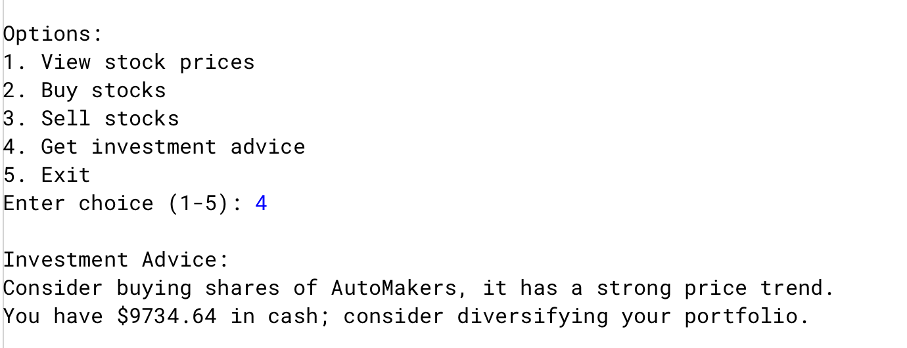
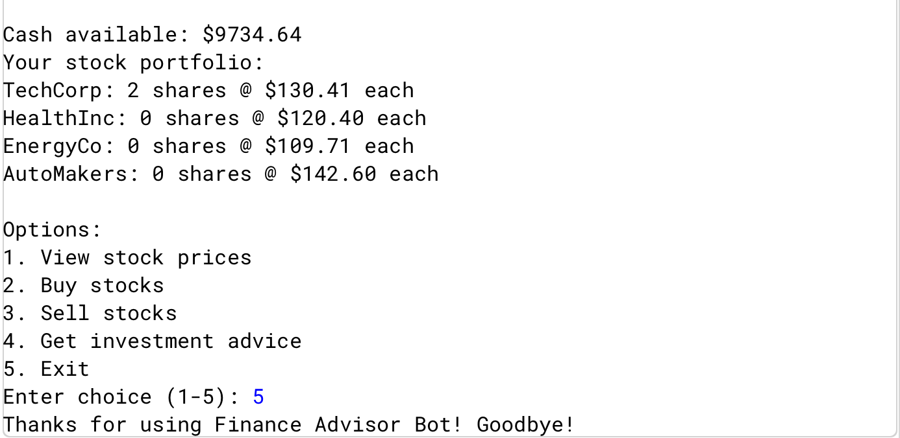

# Trading Advisor Chatbot

## Purpose
This Java program is an interactive chatbot designed to provide financial trading advice. Users can input market scenarios, ask about trading strategies, or request guidance on investments. The chatbot demonstrates advanced Java concepts including object-oriented programming, conditional logic, loops, and user input handling.  

## Features

1. **Interactive User Interface**  
   The program engages users through a menu-driven interface, allowing multiple queries and advice sessions.  

     

2. **Personalized Financial Advice**  
   The chatbot responds to different user inputs with context-aware guidance, simulating a real trading assistant.  

     

3. **Scenario-Based Learning**  
   Users can input hypothetical market situations to learn how different strategies may play out.  

     

4. **Multiple Response Types**  
   The program gives advice, explanations, and tips in different formats to improve understanding.  

     

5. **Data-Driven Decisions**  
   Uses internal logic to evaluate risk and provide tailored recommendations based on user input.  

     

6. **Summarizes Information**  
   Ends the program with key takeaways and money gained/lost.   

     

---

## How It Works
1. **User Query**  
   The user selects an option from the main menu and inputs a scenario or question.  

2. **Chatbot Processing**  
   The program evaluates the input using predefined logic and methods to determine the best response.  

3. **Advice Output**  
   The chatbot displays advice, explanations, and risk assessments.  

4. **Exiting**  
   The program will repeatedly ask the user to select an option until the user selects **3**, which exits the program.  

---

## Skills Showcased
- Object-Oriented Programming (Classes, Methods, Objects)  
- Control Flow and Decision-Making (If/Else, Switch, Loops)  
- User Input Handling (Scanner)  
- Modular and Extensible Design  
- Interactive Console Applications  
